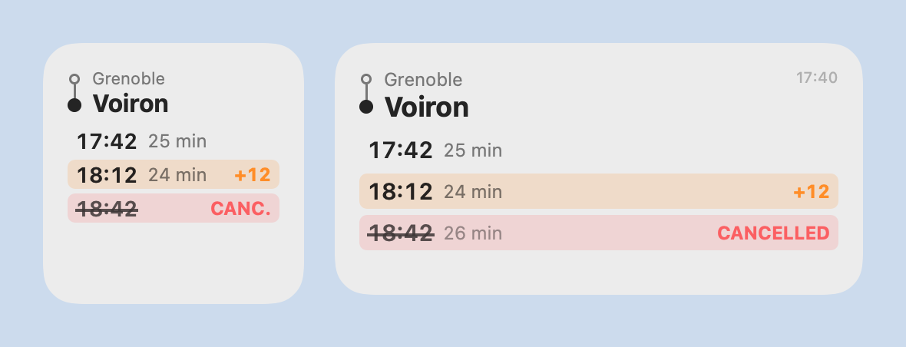
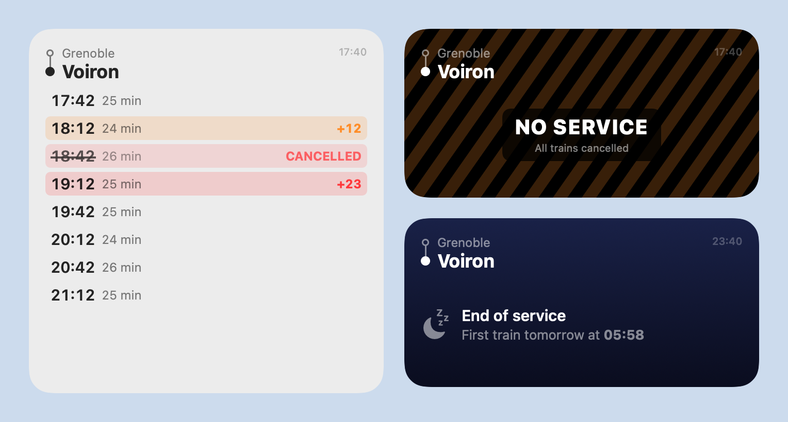

# Trains near me

[](https://github.com/Wonskcalb/trains-near-me/actions/workflows/ci.yml)
[](https://github.com/Wonskcalb/trains-near-me/releases/latest)

[](LICENSE)

A native macOS widget showing the next **direct** trains for one journey (e.g. Grenoble → Voiron), with real-time delays and cancellations from the official SNCF API.

<picture>
  <source media="(prefers-color-scheme: dark)" srcset="Design/widget-dark.png">
  
</picture>

- **Pure Swift:** SwiftUI, WidgetKit, App Intents and Core Location. No third-party dependencies.
- **No backend:** the Mac talks only to `api.sncf.com` and Apple's location services. Your location never leaves the Mac.
- **One journey per widget:** pick the two stations in the widget's own settings.
  - **Direction:** fixed, reversed, or automatic. Automatic flips the journey at a switch time, 13:00 by default.
  - **Nearest station:** optionally, the configured station closest to you becomes the departure.

**Just want to use it?** Follow the step-by-step guide: [GUIDE.md](GUIDE.md). You'll need Xcode and a free Apple account, and one script does the build and install:

```bash
sh scripts/install.sh
```

> Not affiliated with SNCF. Train data © SNCF, via the [SNCF open data API](https://numerique.sncf.com/startup/api/).

## Setup

Requires macOS 15 or later and Xcode 16 or later.

1. **Get a free SNCF API token** at <https://numerique.sncf.com/startup/api/token-developpeur/>. The free tier allows 5,000 requests per day.
2. **Set your signing team.** A free Personal Team is enough to run the widget on your own Mac:
   ```bash
   cp Config/Local.xcconfig.example Config/Local.xcconfig
   ```
   Then edit `DEVELOPMENT_TEAM` and `BUNDLE_ID_PREFIX`. Both targets read them, so they always share the same App Group, which is how the widget reads the token.
3. **Open `TrainsNearMe.xcodeproj` and run the `TrainsNearMe` scheme.** In the window:
   - paste the token and click **Save and test**;
   - accept the location prompt if you want nearest-station mode.
4. **Add the widget:** right-click the desktop › **Edit Widgets** › **Trains near me**. Then right-click the widget › **Edit** to pick the stations.

The Xcode project is generated from `project.yml` with [XcodeGen](https://github.com/yonaskolb/XcodeGen). After editing `project.yml`, regenerate it:

```bash
brew install xcodegen
```

```bash
xcodegen generate
```

## Layout

```
SNCFCore/   Swift package: domain model, SNCF client + parser, direction/position logic, refresh plan, tests
Widget/     Widget extension: App Intent configuration, timeline provider, SwiftUI views
App/        Host app: stores the API token, requests location permission (one window)
Config/     Shared build settings; Local.xcconfig (git-ignored) holds your team id
Design/     App icon renderer, widget screenshot renderer and the rendered images
scripts/    install.sh (build + install), render-screenshots.sh
```

## Display

**Rows** show the scheduled time, the journey duration and a status:

| Status | Row style | Badge |
|---|---|---|
| Delay of 0–10 min | Plain | — |
| Delay of 11–19 min | Orange tint | e.g. `+12` |
| Delay of 20 min or more | Red tint | e.g. `+23` |
| Cancelled | Red tint, struck-through time | `CANCELLED` |
| Disrupted, delay unknown | Orange tint | `delay ?` |



**Widget-wide states**:

| State | When it appears |
|---|---|
| **NO SERVICE** on hazard stripes | Every remaining train of the day is cancelled |
| **End of service** on a night sky | Today's last train has left; shows the first train of the next service day. Trains up to 03:00 count as the previous evening. |
| **No trains** | SNCF found no direct train at all |
| **SNCF data unavailable** | Offline, token missing or rejected, quota reached, server error, or unexpected data. The widget shows the reason. |
| **Data out of date** | The last fetch is 30 minutes old or more. Old trains are never shown as current. |
| Orange **Location** line | Nearest-station mode is on but no location was available. The configured order is used instead; clicking the widget opens the app, which refreshes it with a fix. |

## How it uses the SNCF API

The API is Navitia-based. Docs: <https://doc.navitia.io>. Authentication is HTTP Basic, with the token as the username and an empty password.

- **Departures:** `GET /coverage/sncf/journeys?from=…&to=…&data_freshness=base_schedule&max_nb_transfers=0&direct_path=none&min_nb_journeys=8`
- **Station search:** `GET /coverage/sncf/places?q=…&type[]=stop_area`, used by the widget configuration.

**Why `base_schedule`:** with `realtime`, cancelled trains disappear from the results. With `base_schedule`, every scheduled trip is returned, and real-time changes come as linked disruptions. One request therefore gives schedules, delays and cancellations.

**Fields used:**

- `journeys[].status`: `NO_SERVICE` or `SIGNIFICANT_DELAYS`.
- `disruptions[].severity.effect`, for disruptions linked from `sections[].display_informations.links[]`.
- `impacted_stops[]`, matched on the origin and destination stop points:
  - `base_departure_time` and `amended_departure_time` give the delay;
  - a `deleted` departure or arrival status at either stop means the train counts as cancelled.

**Filtering:** a journey is kept only if it has exactly one `public_transport` section, running from the configured origin stop area to the configured destination stop area. That excludes connections and "walk to another station" itineraries.

## Refresh and WidgetKit limits

- **One reload, one SNCF request.** The timeline then holds:
  - an entry just after each departure, so departed trains drop off;
  - a final entry at +30 min that switches the widget to "Data out of date".
- **Requested reload interval:** 15 min. It is 60 min when there are no trains, and the widget also reloads at the automatic switch time.
- **macOS decides when reloads actually happen.** Widgets get a limited daily reload budget, and reloads come late when the Mac sleeps or the widget isn't visible. Delays can therefore be 15–30 min old. This is not a live departure board: the header shows when the data was fetched.
- **Location:** the widget reads the system's cached fix if it is under 15 min old. Otherwise it waits up to 5 s for one fix. The coordinates are only compared with the two station coordinates. macOS reliably hands widgets a fix only while the host app is active, so the app reloads the widget every time it opens.

## Tests

```bash
cd SNCFCore && swift test
```

The 31 tests make no live API calls. They cover:
- **Direction:** fixed, reversed, automatic around 13:00, custom switch time.
- **Nearest station:** nearer to A, nearer to B, a tie, no location, and location overriding the configured order.
- **Delay bands:** 0, 5, 10, 11, 19, 20 and 21 min, cancellation, unknown delay.
- **Journey filtering**, and the **service day**: tomorrow's trains are not listed today, a 00:15 train still counts as tonight, and end of service is told apart from all trains cancelled.
- **Response parsing**, against the fixtures in `SNCFCore/Tests/SNCFCoreTests/Fixtures`: on time, delayed, cancelled, missing real-time data, all trains cancelled, `no_solution`, malformed data, station search.
- **Refresh plan.**

## Troubleshooting

| Symptom | Cause | Fix |
|---|---|---|
| Station search fails with error `0` (token missing) | The app and the widget were signed with different teams, so they use different App Groups | Set `DEVELOPMENT_TEAM` in `Config/Local.xcconfig` only, so both targets get the same team |
| The location prompt never appears; the app stays at "Not requested" | macOS remembers an earlier signing identity for that bundle id | Change `BUNDLE_ID_PREFIX` |
| The widget has no **Edit** option | Xcode's debug dylib hides the App Intent from the system | Keep `ENABLE_DEBUG_DYLIB: NO` in `project.yml` |

## Screenshots

The images in `Design/` are rendered from the real widget views, so they never drift from the code:

```bash
sh scripts/render-screenshots.sh
```

## Contributing

See [CONTRIBUTING.md](CONTRIBUTING.md). Release history is in [CHANGELOG.md](CHANGELOG.md).

## License

[MIT](LICENSE)
